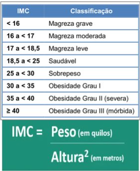

# Calculadora de IMC para console 

Uma calculadora simples para calcular o IMC (Índice de Massa Corporal) de uma pessoa utilizando a linguagem Dart 

## Checklist do Desafio

- [ ] Criar classe Pessoa (Nome / Peso / Altura)​
- [ ] Ler dados do terminal​
- [ ] Tratar exceções​
- [ ] Calcular IMC ​
- [ ] Printar na tela o resultado do cálculo​
- [ ] Testes​

